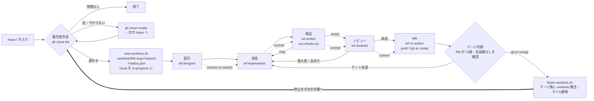

# WORKFLOW ルール — デリバリーワークフローの全体像と必須作業

このリポジトリの作業は、Skill（`.claude/skills/`）＋専門サブエージェント（`.claude/agents/`）で
ノードごとに進める。本書が **ワークフローの真実源**（各 SKILL.md は本書を参照する）。

> **AIDD（AI駆動開発）フレームワーク**: 本ワークフローは「どんなアプリ開発でも不変」な汎用フローで、
> プロジェクト固有（言語/基盤/配信先/ユーザー像）は **`.claude/config.json`（機械可読）**・
> **`.claude/PROJECT.md`**・**`.claude/docs/`** と本 `rules/` に外出ししてある。スクリプトは config を
> 読んでスタックに依存せず動く（`run-checks.sh` は `components[].checks` を実行）。新規プロジェクトは
> `project-init` Skill が雛形から設定を生成する。品質バー（評価6観点）と自己改善は §6 / [QUALITY.md]。

## 0. 大原則

- **1 Issue = 1 worktree = 1 ブランチ = 1 作業フォルダ**: 作業開始時に
  **`bash .claude/skills/wf/scripts/new-worktree.sh "<タスク名>" [issue番号] [種別]`** で
  `.worktree/<issue_name>/` に専用 git worktree＋ブランチを作り、**その中で作業する**（main 直コミット禁止）。
  worktree 内に `docs/issues/<issue_name>/status.json` を起こし、全ノードがこの 1 ファイルを更新する。
  `<issue_name>`＝ブランチ名＝Issue があれば `NN-<slug>`、無ければ `<slug>`。`.worktree/` は gitignore。
  status.json は監査証跡＝コミット対象（スキーマ `.claude/templates/status.schema.json`）。
  PR マージ後は **`finish-worktree.sh <issue_name> [issue番号]`** で撤去。
- **二重作業の防止＋開始の可視化（多層防御）**: `new-worktree.sh` は以下を順に通過した「勝者」だけが
  worktree/branch を作る（敗者はファイル副作用ゼロ）。
  - **① ローカル hard lock**: 同名ブランチ/worktree があれば失敗。
  - **② in-progress ラベル**（cross-machine の advisory lock）: `gh` があれば Issue の `in-progress`
    ラベルを見て中断（続けるなら `--force`）。開始時に **Issue へ `in-progress` ラベル＋開始コメント** を付与。
  - **③ コメント全順序の楽観ロック**（②のラベル check→set が非アトミックで残る TOCTOU を埋める）:
    `🔒 claim worker=<id> ts=<UTC ISO>` を Issue に投稿 → 少し待って read-back → **REST
    `gh api repos/{owner}/{repo}/issues/N/comments` の数値 `id`（全順序キー。`gh issue view` は id を
    返さないため不可）** で有効 claim を id 昇順に並べ、**最小 id が自分なら勝者＝着手**、他人が先なら
    `🤝 yield` コメントを残して `exit 1`（worktree/branch は作らない）。自分の claim が read-back に現れても
    即着手せず、**短い待機後にもう一度全コメントを取り直して最小 id を再判定する「収束 re-read」**を挟む
    （遅延伝播していた相手のより小さい id を取りこぼさないため。再判定で自分より小さい有効 claim が現れたら
    敗者として yield、収束 re-read 自体が失敗したら degrade で着手継続）。**真の同時 claim の残留二重当選窓は
    低確率で、この勝者側の収束 re-read＋多層防御（① ローカル hard lock／② in-progress ラベル）で限定される**
    （万一着手しても別 branch/別 worktree なので衝突は PR 時に顕在化する）。worker ID は
    `$CLAUDE_CODE_SESSION_ID`（未設定時は `hostname-pid-rand` を合成）。同一 worker の `✅ done`/`🤝 yield`
    がある claim と TTL（既定 `LOCK_TTL_HOURS=6`）超過の claim は無効＝stale としてクラッシュ復帰可。
    `gh` 不在・issue 番号なし・REST 失敗時はコメントロックを **skip して従来挙動で続行**（着手をブロックしない
    degrade）。`--force` は楽観ロックも上書きして着手。`finish-worktree.sh` は完了時に `✅ done worker=<id>`
    を投稿して claim を解放する（best-effort）。
    可変パラメータ（環境変数）: `LOCK_READBACK_SLEEP`（read-back 待ち秒・既定1.5）/
    `LOCK_CONVERGE_SLEEP`（収束 re-read 前の待ち秒・既定は `LOCK_READBACK_SLEEP`）/
    `LOCK_READBACK_RETRY`（自分の claim が見えるまでのリトライ回数・既定5）/ `LOCK_TTL_HOURS`（既定6）/
    `WF_LOCK_DRYRUN=1`（gh を叩かずモック動作・競合シナリオの検証用）。
- **status は JSON・更新はスクリプト経由**（手で JSON を編集しない）: ノードの状態・チェック・コミットは
  **`python3 .claude/skills/wf/scripts/status.py {node|check|commit|set|show} …`** で更新する。
- **フォーマット原則（md vs JSON）**: スクリプトが読み書きする「**状態・データ**」は JSON
  （status / レッスン `backend/data/lessons` / シード `backend/data/seeds` / eval spec）。人間が執筆・
  レビューする「**散文・設計・ルール**」は Markdown（`設計書.md` / `要件定義書.md` / `.claude/rules/*` /
  `docs/design/ui/*`）。新規ドキュメントはこの原則で形式を選ぶ。
- **Issue 連携は GitHub（`gh`）**: 優先度判断は `gh issue list`、MR は `Closes #NN`。status.json の
  `issue` / `issue_url` に保持（`new-status.sh` が `gh` で URL を補完する）。
- **定型作業は必ずスクリプト経由**（手打ち禁止）: test / lint / 検証 / コンテンツ検証は下表の
  スクリプトでのみ実行する。スタック固有コマンド（`pytest` / `flutter analyze` 等）を**直接叩かない**
  （`run-checks.sh` が `.claude/config.json` の `components[].checks` から解決する）。
- **メトリクスを記録する**（トークン/速度/手戻り/成果物）: 各ノードの開始/完了で
  **`python3 .claude/skills/wf/scripts/status.py metric <status.json> <node> --start|--end`**、
  差し戻し時 `--loopback`、commit 時 `--artifacts <変更ファイル数>`、トークンは best-effort で
  `--tokens in=.. out=..`。これらは `retro` Skill が §6 の6観点で**前回比の相対評価**に使う。
- **Skill を修正したら eval を回す**: SKILL.md / agent / スクリプトを変更したら
  **`bash .claude/skills/run-evals.sh`** で作業忠実度のデグレ確認・精度評価を行い PASS を確認する（§4）。
- **コミットはノード完了ごと**（[GIT.md]）。`push` / `gh pr create` は外向き操作。
- **`main` へのマージは PM の判断で行う（sub エージェントに委譲しない）**: MR ノードは PR の作成までを
  担い、**マージするか否かは PM が決める**。PR 作成後に **CI 緑・重大度高の未解消なし・各ノード commit 済み**
  のマージ前ゲート（[GIT.md]「マージ前ゲート」）を PM 自身が確認し、満たせば `gh pr merge` で取り込む
  （満たさなければ実装へ差し戻す）。判断は PM が自走して下す＝ユーザーに可否を仰がない（予算超過の恐れが
  ある場合のみ例外）。
- **停止は重大な判断＝1 タスク完了で止まらない**: 後片付けまで終えたら、PM は報告したうえで **止まらず
  優先度判定へ戻り**、`gh issue list` で次の最優先タスクを選んで着手する（フローのループ）。停止してよいのは
  「残務がない」か、escalation 相当（予算超過の恐れ／取り消し困難・品質致命の判断）に当たったときだけ。
  完了報告して次の指示を待つ＝禁止（[../../CLAUDE.md] の運用原則と一致）。
- 対話・報告は **日本語**。コード識別子・LLM プロンプト・正準コンテンツは英語。

## 1. 全体フロー

**ループは閉じる＝停止しない**: 1 タスクの後片付けが終わったら、PM は止まらずに **優先度判定へ戻り**、
次の最優先タスクを選んで着手する（§0「停止は重大な判断」）。残務がない、または予算超過・取り消し困難な
判断に当たって初めて停止する。

単一ノードだけ回す Skill（`wf-design` / `wf-implement` / `wf-verify` / `wf-review` / `wf-mr`）も
同じ必須作業に従う。`content-gen`（著作）と `ui-design`（UI）は専用ノードで、検証は下表のスクリプトを使う。

## 2. ノード別の必須作業チェックリスト

各ノードは status.json を `status.py` で更新し、**必須スクリプトを実行**し、**完了時に commit**
（`status.py commit` で記録）する。

| ノード | Skill / agent | 必須スクリプト | 完了条件（省略不可） | commit メッセージ |
|---|---|---|---|---|
| 優先度判定 | wf | `gh issue list` | 着手 or 起票の判断。予算超過の恐れは PM 判断でユーザーへ | （なし） |
| 作業開始 | wf | `new-worktree.sh "<名>" [#] [種別]` | worktree＋ブランチ作成・status.json 起票・Issue を in-progress に・二重作業 lock | （なし） |
| 設計 | wf-design / wf-designer | — | スコープ・影響範囲・受入基準を記載 | `設計: <名> (#NN)` |
| 実装 | wf-implement / wf-implementer | — | 受入基準を満たす・規約順守（[CODING.md]） | `実装: <名> (#NN)` |
| 検証 | wf-verify / wf-verifier | **`run-checks.sh`**（content は加えて **`check-content.sh`**） | RESULT: PASS・カバレッジ ≥90%・動作確認記録 | `検証: <名> (#NN)` |
| レビュー | wf-review / wf-reviewer | — | 重大度・高をすべて解消（解消後 検証を再 PASS） | `レビュー対応: <名> (#NN)` |
| MR | wf-mr / wf-mr-author | `run-checks.sh`（最終確認） | 日本語 PR・`Closes #NN`・検証結果・trailer・push/PR 作成 | （PR 作成） |
| **マージ判断** | **wf（PM 自身）** | `gh pr checks` / `gh pr merge` | **CI 緑・高指摘なし・各ノード commit 済みを PM が確認**し `gh pr merge`。ゲート未達は差し戻し | （マージ） |
| 後片付け | wf | `finish-worktree.sh <name> [#]` | マージ後に worktree 撤去・`in-progress` ラベル解除 | （なし） |
| **次タスクへ** | **wf（PM 自身）** | `gh issue list` | **停止せず優先度判定へ戻り**、次の最優先タスクに着手（残務なし／escalation 相当のみ停止） | （なし） |

検証 FAIL → 実装へ差し戻し。レビューで重大度・高 → 実装→検証へ差し戻し。
**マージ判断は PM の専管**（sub エージェントに委譲しない）。MR ノードは PR 作成まで、マージ可否は PM が決める。
**後片付け後は停止せず優先度判定へ戻る**（ループ）＝完了報告して指示待ちは禁止。

## 3. スクリプトカタログ（定型作業の唯一の入口）

| スクリプト | 役割 |
|---|---|
| `.claude/skills/wf/scripts/new-worktree.sh` | 作業開始: `.worktree/<issue_name>/` に worktree＋ブランチ＋status.json を作り、Issue を in-progress に。二重作業 lock |
| `.claude/skills/wf/scripts/finish-worktree.sh` | マージ後の後片付け: worktree 撤去・`in-progress` ラベル解除（`--force` で未コミット破棄） |
| `.claude/skills/wf/scripts/new-status.sh` | `docs/issues/<issue_name>/status.json` を作成（`status.py new` の薄いラッパ。worktree 不要な単発用） |
| `.claude/skills/wf/scripts/status.py` | status.json の更新自動化（`new` / `name` / `node` / `check` / `commit` / `metric` / `set` / `show`）。`metric` でトークン/速度/手戻り/成果物を記録 |
| `.claude/skills/lib/config.py` | `.claude/config.json` の読取りヘルパ（py/bash 共用。`root` / `get <dotted>` / `checks` / `components`）。スクリプトはスタックを直書きせず本ヘルパ経由で config を読む |
| `.claude/skills/wf-verify/scripts/run-checks.sh` | 変更領域を検出し **config の `components[].checks`**（lint/test・`coverage_gate`）を該当 component の `cwd` で実行。スタック非依存（pytest/flutter 等は config 由来）。`--all` で全 component 強制 |
| `.claude/skills/content-gen/scripts/check-content.sh` | 著作レッスンを `validate-lesson.py`（ゲート静的検証）＋ `run-checks.sh` で検証 |
| `.claude/skills/content-gen/scripts/validate-lesson.py` | レッスン JSON を serve 時ゲート観点で静的検証（blockquote 禁止 / 出典必須 / 言い換え / questions 2〜8 / 層構造対応） |
| `.claude/skills/run-evals.sh` | 全（or 指定）Skill の eval を実行＝作業忠実度のデグレ確認・精度評価 |

新しい定型作業が生まれたら **まずスクリプト化**し、本カタログと該当 SKILL.md に追記する。

## 4. Skill の自動評価（eval）— 修正時のデグレ確認・精度評価

各 Skill は `.claude/skills/<skill>/eval/spec.json` に評価仕様を持つ。SKILL.md / agent / スクリプトを
修正したら **`bash .claude/skills/run-evals.sh [<skill>]`** を回し、PASS を確認してからコミットする。

- **contracts**: SKILL.md / agent に必須記載（必須スクリプト名・チェックリスト・commit 規約 等）が
  残っているかを検査（消えると FAIL ＝ 例の「スクリプトが使われない」デグレを機械検出）。
- **commands**: スクリプトの挙動・精度を fixture で検査（例: `content-gen/eval/fixtures/` の good/bad
  レッスンで `validate-lesson.py` の判定が正しいか）。
- 仕様は宣言的 JSON。共有ランナーは `.claude/skills/eval_runner.py`。新しい必須要素を SKILL に足したら
  対応する spec.json の `must_contain` にも足す（eval 自体を陳腐化させない）。

## 5. 拡張 Skill（アプリ開発・専用作業／ドメイン非依存）

過去作業の頻出パターンから抽出した、どんなアプリ開発でも出る専用作業を Skill 化している（フローノードと
同じ必須作業＝status/メトリクス/検証/commit に従う）。スタックは config で切替。
`ui-design` / `api-design` / `data-migration` / `i18n` / `runtime-verify`（動作検証）/ `deploy` / `release` /
`debug` / `refactor` / `ci`。**ドメイン固有**（例: 学習レッスン著作 `content-gen`）は config の
`domain_skills` で有効化する任意プラグインで、汎用フレームワークには含めない。

## 6. 品質バーと自己改善（メトリクス → retro）

- 全作業は **6観点の品質バー**（[QUALITY.md]）を満たすことを目指す: ① 手戻りなし ② 無駄に遅くない
  ③ 網羅性・検証の充足（薄すぎない）④ トークンが過大でない ⑤ 成果物が高品質 ⑥ 抜け漏れなし。
- 各ノードは status.json に **メトリクス**（トークン/速度/手戻り/成果物数）を記録する（§0）。
- **`retro` Skill** が完了タスクの台帳・メトリクス・PRレビュー指摘を6観点で分析し、「指摘を受けないには
  どうすべきだったか」を反省して **Skill/rule を改善**する。採点は**上限なし加点・前回比の相対評価**
  （`docs/retro/scoreboard.json`）。改善は **修正前後の成果物をブラインド A/B 比較**（どちらが修正後か
  伏せて別 agent が判定）し、勝ったものだけ採用 → `run-evals.sh` 再実行＋ eval spec へ不変項追加で固定。

## 7. 関連ルール

- コミット/ブランチ/PR: [GIT.md]
- コーディング規約: [CODING.md]
- データ/コンテンツ/ライセンス: [DATA_POLICY.md]
- セキュリティ: [SECURITY.md]
- ディレクトリ: [DIRECTORY.md]
- 品質バー（評価6観点）: [QUALITY.md]
- UI デザインシステム: [../../docs/設計書.md] §8
