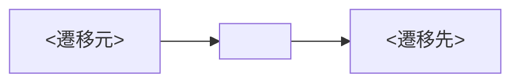

<!--
画面ドキュメントのテンプレート（docs/design/ui/<screen>.md）。
1 画面 = 1 ファイル。実装（app/lib/features/<feature>/presentation/…）と GoRouter（core/router/app_router.dart）
を正とし、変更時はこのドキュメントも同じ PR で更新する（コードと乖離させない）。
全画面の索引・遷移図は docs/design/ui/README.md。
-->

# 画面: <ScreenName>（`<route>`）

| 項目 | 値 |
|---|---|
| ルート | `<route>`（例 `/content/:conceptId`） |
| パラメータ | path: `<:param>` / query: `<key（既定値）>` / なし |
| 実装 | `app/lib/features/<feature>/presentation/<file>.dart` |
| feature | `<feature>` |
| 遷移種別 | fadeThrough / sharedAxis / scaleFade / 既定 |

## 目的
<この画面が果たす役割を 1〜2 文で>

## 主な状態
- **通常**: <内容>
- **ローディング**: <スケルトン/スピナー 等>
- **空**: <空表示の有無と内容>
- **エラー**: <エラー表示>
- **ロック（課金）**: <該当すれば LockedContentView 等>

## 入口（遷移元）
- `<元ルート>` — <トリガー（リダイレクト条件 / ボタン 等）>

## 出口（遷移先）
| 遷移先 | トリガー | 手段 |
|---|---|---|
| `<先ルート>` | <操作/条件> | `context.go` / `context.push` / redirect / popOrHome |

## 主なコンポーネント / プロバイダ
- **Widget**: `<SharedWidget>` — <用途>
- **Provider**: `<provider>` — <役割>

## i18n / 特記事項
- l10n: `<keys>`（`lib/l10n/*.arb`、直書き禁止）
- <演出・ガード・アクセシビリティ（Reduce Motion）・課金ゲート 等の特記>

## 遷移図（この画面の周辺）

